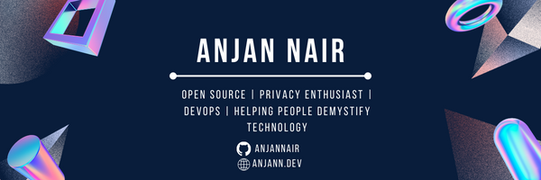

### Aloha 👋

 
 
 
<h3 align="center"> Telecommunication Engineer, Tech Enthusiast</h3>

  

I am Anjan, a passionate tech enthusiast. Currently pursuing my B.Tech in Electronics and Telecommunication.

Apart from programming I participate in robotics competitions! 

## ⚡ Technologies

                             

 

&nbsp;

